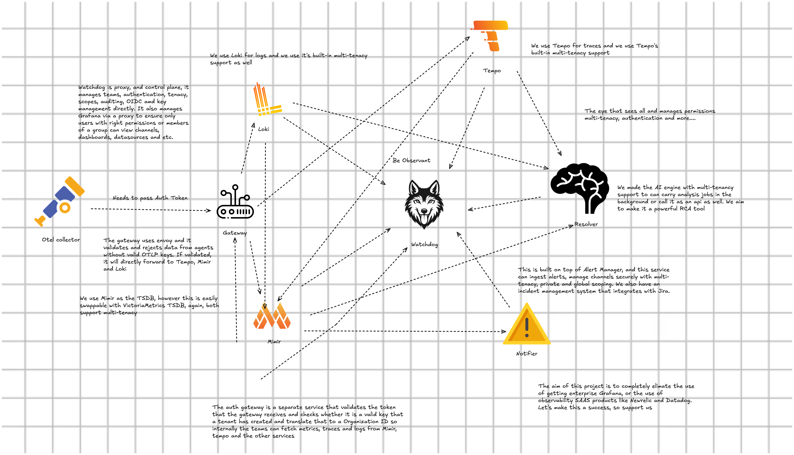

# Observantio 🚀

At Observantio, we transform raw noise into actionable intelligence. We’re simplifying the modern observability stack—from LGTM to the edge—by combining high-performance orchestration and AI-driven analysis with seamless incident collaboration. We provide a powerful, full-stack observability platform designed for everyone.

Our tools are built on top of OSS tools, so you don't have to pay a dime and you are in full control of your data.

---

## 🏛 The Ecosystem

We believe that observability shouldn't be a collection of disconnected tabs charging you for every GB ingested, every GB retained and charged per user. Our projects work together to form a unified "Control Plane" on top of your telemetry data that sees it all for free

### 🛰 [Watchdog](https://github.com/observantio/watchdog)

**The Unified Control Plane.** The entry point for your entire stack. It secures and unifies metrics, logs, traces, AiOps and alerts into a single, RBAC-protected interface. Built for the LGTM stack, it eliminates context-switching using keys and provides a true "Single Pane of Glass."

### 🧠 [Resolver](https://github.com/observantio/resolver)

**The AI Reasoning Engine.** Stop guessing. **Resolver** uses custom-built analytics to perform Root Cause Analysis (RCA), anomaly detection, and predictive forecasting. It correlates signals across Loki, Tempo, and Mimir to tell you exactly where the "smoking gun" is.

### 🔔 [Notifier](https://github.com/observantio/notifier)

**The Incident Hub.** Alerting is only half the battle. **Notifier** manages the human side—incident lifecycle, team collaboration, Jira syncing, and intelligent alert routing. It ensures the right people get the right data at the right time.

---

## 🛠 Our Technology Stack

We build for performance, security, and scale. Our tools are native to the modern cloud-native landscape.

* **Core:** Python (FastAPI), OpenTelemetry (OTLP), Envoy, NGINX and Postgres
* **Storage and Other Tools** Prometheus/Mimir, Grafana/Loki, Tempo, VictoriaMetrics.
* **Security:** Asymmetric JWT (RS256), MFA/TOTP, OIDC/Keycloak, HashiCorp Vault Support, OTLP_AUTH_TOKENS
* **Delivery:** Docker Compose, Kubernetes (Coming soon), CI/CD gated with comprehensive Pytest suites.

---

## 🤝 Philosophy & Contributions

> **"Observability is not about more data; it's about more answers."**

We are an open source organization dedicated to creating tools that SREs genuinely enjoy using. Our approach centers on "Security-First" and "Automation-Always" principles, empowering teams of all sizes to work efficiently and securely.

### Want to contribute?

We welcome engineers who are passionate about distributed systems, causal analysis, and backend architecture.

### How We Work

1. **Standardize:** We use strict pre-commit hooks and testing gates across all repos.
2. **Report Issues:** Please report bugs or feature requests via GitHub Issues.
3. **Pull Requests:** Submit PRs with clear descriptions and reference related issues.
4. **Code Review:** All contributions are reviewed for quality, security, and style.
5. **Documentation:** Update docs for any user-facing changes.
6. **NOTICE** If you do change a file, you may put your name, and include what you changed

---

## 📄 License & Legal

All Observantio projects are licensed under the **Apache License 2.0**. We believe in the freedom to innovate while maintaining clear attribution and a strong disclaimer of liability.

Note: Observantio is an independent organization created by Stefan Kumarasinghe. We are not affiliated with, sponsored by, or endorsed by the official Grafana or Prometheus projects or Victoria Metrics, though we love and build upon their amazing foundations.
